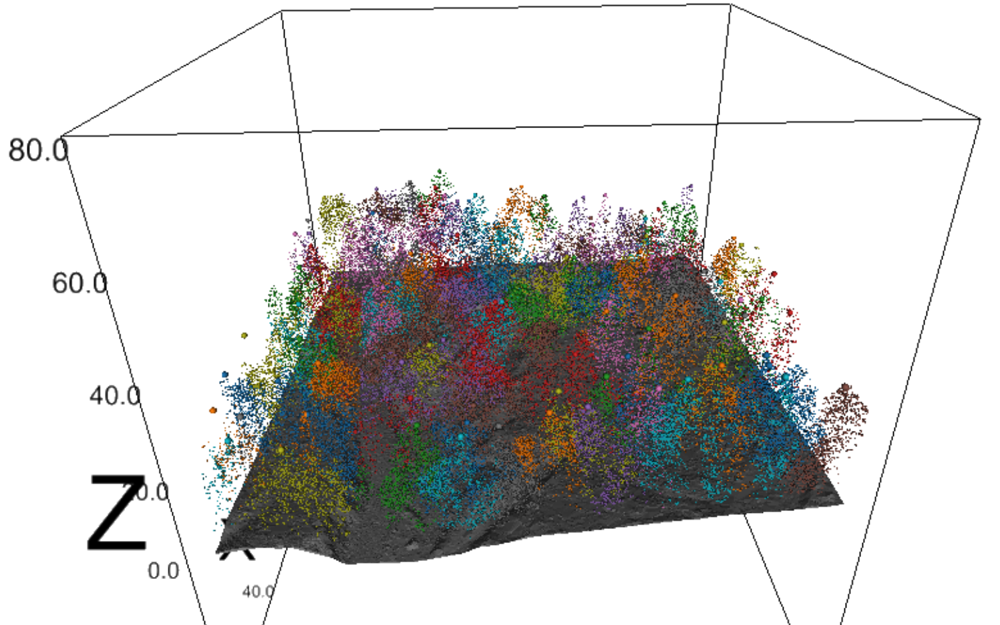
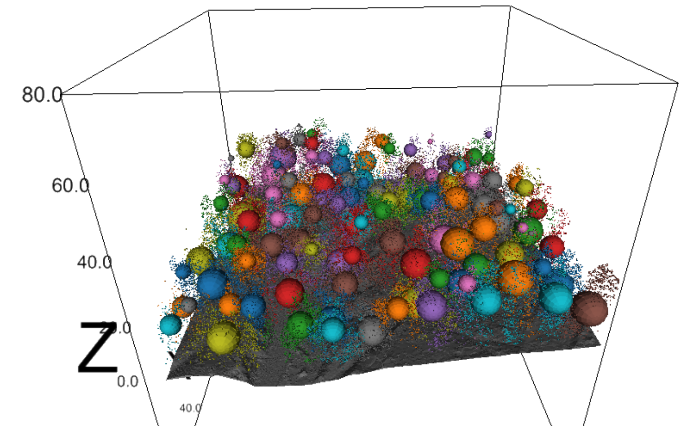
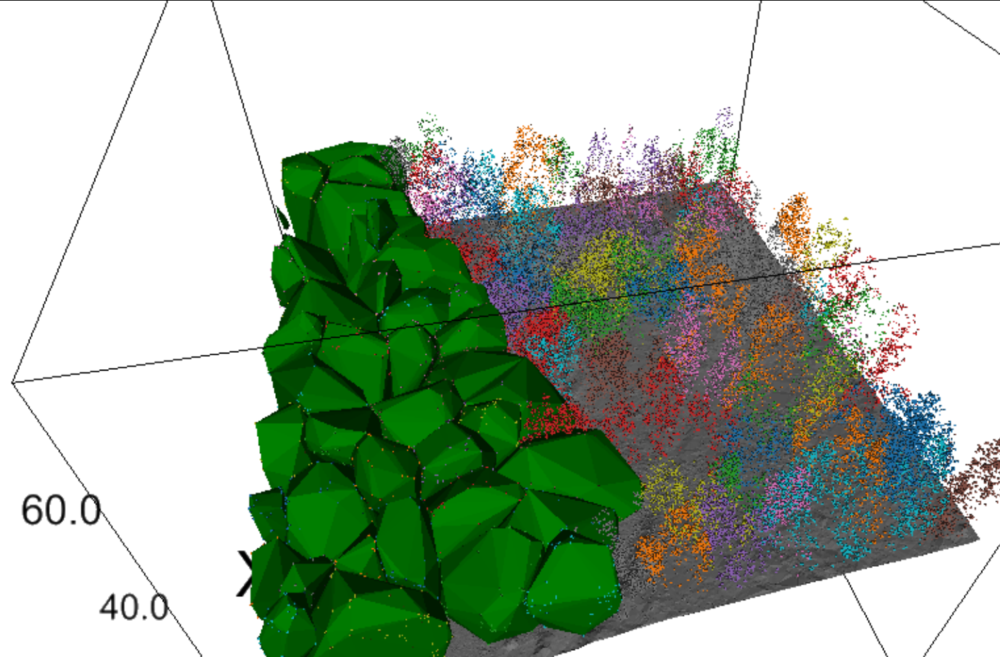

# Lidar pointcloud processing using python pdal and ipyvolume

This is just me trying out pdal for point cloud processing and potencial forestry application

|||
|---|---|
|||

## Documentation
PDAL: [Documentation](https://pypi.org/project/PDAL/)

Ipyvolume: [Documentation](https://ipyvolume.readthedocs.io/en/latest/)
